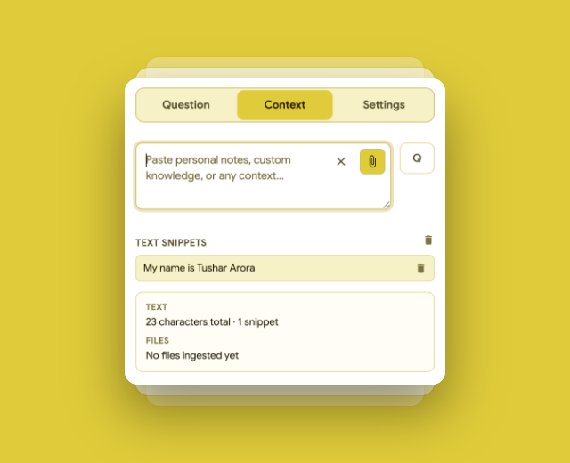
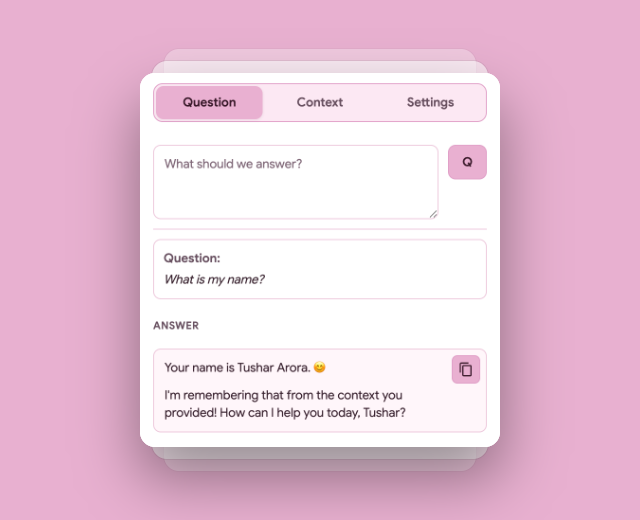
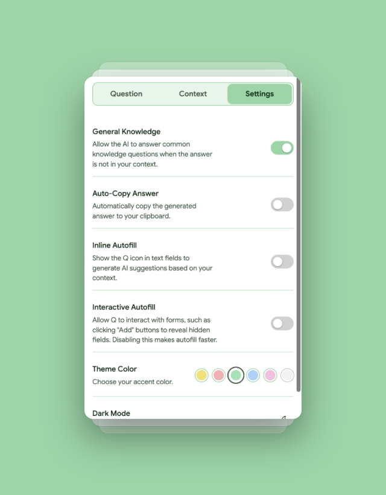
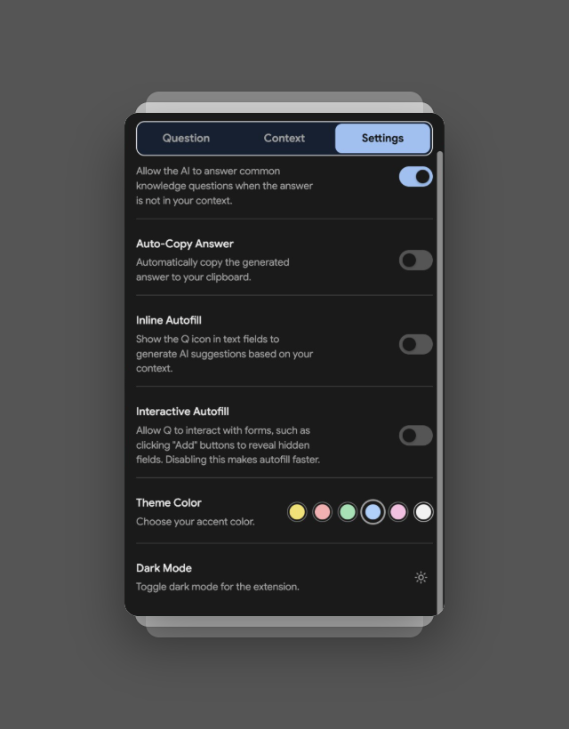

<h1 align="center">
  
  <br>
  Q It
</h1>

<h4 align="center">Your On-Device AI Autofill & Context Assistant</h4>

<p align="center">
  <strong>A privacy-first Chrome extension that uses on-device AI (Gemini Nano) to autonomously autofill complex job applications and chat with your personal context.</strong>
</p>

<p align="center">
  <a href="#-features">Features</a> •
  <a href="#-getting-started">Getting Started</a> •
  <a href="#-how-to-use">How To Use</a> •
  <a href="#-configuration">Configuration</a> •
  <a href="#-testing">Testing</a>
</p>

---

**Q It** is a powerful, privacy-first Chrome extension that leverages Chrome's built-in on-device AI (Gemini Nano). It helps you instantly fill out complex forms, job applications, and answer questions based solely on your personal context—**without ever sending your data to the cloud.**

## 📸 Screenshots

<p align="center">
  
  &nbsp; &nbsp; &nbsp;
  
</p>
<p align="center">
  
  &nbsp; &nbsp; &nbsp;
  
</p>

## 🆕 What's New in v1.1

- **Interactive Autofill:** The page-level autofill agent now has a toggleable setting to autonomously interact with forms (e.g., clicking "Add" buttons to reveal hidden fields).
- **Streaming AI Responses:** Answers in the Q&A chat now stream in real-time, word-by-word.
- **Auto-Copy Answer:** A new setting to automatically copy AI responses to your clipboard with a satisfying pop animation.
- **Enhanced UI/UX:**
  - Added a dedicated, animated **Dark Mode** toggle with a seamless circular wipe transition.
  - Redesigned the "Clear Text" button as an inline icon inside the text area.
  - Buttons ("Q" and "Save") are now neatly aligned to the right of their respective input boxes.
  - The tab navigation bar is now sticky, remaining visible even when scrolling through long context history.
  - Toggles and buttons now have clear focus states for improved keyboard accessibility.
  - Added satisfying animations to the delete icons in the context history.
- **Dynamic Statistics:** Context history stats now accurately reflect your currently saved snippets and files in real-time.

## ✨ Features

### 🔒 100% Local & Private
Q It uses the **Chrome Prompt API (Gemini Nano)**. All AI inference happens directly on your machine. Your resume, personal details, and uploaded files never leave your browser, ensuring complete privacy and security.

### 🧠 Universal Memory Context
Build your personal knowledge base in seconds:
- **Highlight & Save:** Select any text on any webpage to instantly add it to your context.
- **File Uploads:** Upload your Resume (PDF), code snippets, or markdown files directly into the extension's memory.
- **Persistent Storage:** Your context is saved locally across browsing sessions.

### ⚡ Smart Inline Autofill
Filling out a job application? Q It intelligently detects profile and job-related fields (Name, LinkedIn URL, Experience, etc.). Simply focus on an input field, and a smart dropdown will suggest the perfect answer based on your stored context.

### 🤖 Autonomous Page-Level Autofill (ATS Optimized)
Tired of manually filling out Workday, Lever, or Greenhouse applications? 
Click the floating **Q** button on any form page. Q It will:
1. **Scan** the entire page for input fields.
2. **Read** your context to determine the best answers.
3. **Autonomously click** "Add Another" buttons (like "Add Work Experience" or "Add Education") if the form doesn't have enough fields for your entire history.
4. **Present** a review modal for you to approve and instantly apply all suggestions.

### 💬 Q&A Chat
Open the Q It popup to chat directly with your context. Ask *"What is my latest job title?"* or *"Summarize my experience with AWS"*, and the AI will answer strictly from your provided documents, adopting a first-person persona.

### 🎨 Beautiful & Customizable
Q It features a clean, minimal UI inspired by Google Sans. Choose from **7 gorgeous pastel themes** (Yellow, Red, Green, Blue, Pink, White, Black) to match your browser's aesthetic.

---

## 🚀 Getting Started

### Prerequisites
Because Q It relies on Chrome's built-in on-device AI (Gemini Nano), you simply need a recent version of Google Chrome.

1. Ensure you are running **Google Chrome version 138** or newer. (You can check your version at `chrome://settings/help`).
2. That's it! No experimental flags or developer builds are required.

### Installation
1. Clone this repository:
   ```bash
   git clone https://github.com/tushar260/q-it.git
   ```
2. Open Chrome and navigate to `chrome://extensions/`.
3. Enable **Developer mode** in the top right corner.
4. Click **Load unpacked** and select the `q-it` directory.
5. Pin the **Q It** extension to your toolbar!

---

## 🛠️ How to Use

### 1. Ingest Your Context
Click the **Q It** extension icon to open the popup. Navigate to the **Context** tab and start building your knowledge base:
- Paste text directly (like an excerpt from your resume).
- Click the **Attachment** icon to upload PDF resumes, Markdown files, or CSVs.
- Right-click highlighted text on any webpage and select **"Q It: Add to context"**.

### 2. Autofill Forms Instantly
Head over to a job board or any complex form (e.g., Workday or Greenhouse).
- **Inline Autofill:** Simply focus on a text input (like "First Name" or "Experience"). A tiny dropdown will appear with the AI's perfect suggestion. Click **"Apply"**.
- **Page Autofill:** Click the floating **Q icon** at the bottom right of the page. Q It will autonomously scan the entire page, calculate all fields, automatically click "Add another" buttons if needed, and show you a final review modal. Click **"Apply Selected"** to fill the entire page in one go.

### 3. Chat with Your Data
Need a quick summary? Open the extension and switch to the **Question** tab. Ask the AI anything about your context, and it will respond directly in your persona. You can easily copy the answer or use the context menu to send questions straight from the webpage.

---

## ⚙️ Configuration

Open the Q It popup and navigate to the **Settings** tab (gear icon) to configure:
- **Themes:** Pick your favorite accent color.
- **Autofill Toggle:** Easily toggle inline autofill on or off.
- **Auto-Click 'Add' Buttons:** Enable/disable autonomous DOM interactions (disabling this makes page-level autofill faster by skipping clicking buttons).

---

## 🧪 Testing

Q It includes a robust suite of unit and end-to-end tests using **Jest** and **Puppeteer**.

```bash
cd q-it
npm install
npm run test
```

*Note: The E2E tests will launch a visible browser window to simulate user interactions.*

---

<p align="center">
  <i>Built with vanilla JavaScript, Shadow DOM, and Chrome Extension Manifest V3.</i>
</p>
